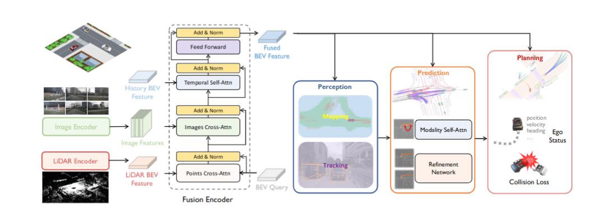

# FusionAD: Multi-modality Fusion for Prediction and Planning Tasks of Autonomous Driving

This repository contains resources related to the paper "FusionAD: Multi-modality Fusion for Prediction and Planning Tasks of Autonomous Driving".

## Overview

FusionAD is an approach to building a unified network for leveraging multi-sensory data in end-to-end manners. It offers enhanced performance on perception tasks, prediction, and planning for autonomous driving. Notably, FusionAD integrates critical information from both camera and LiDAR sensors and uses this data beyond just perception tasks.



## Key Contributions

- Proposes a BEV-fusion based, multi-sensory, multi-task, end-to-end learning approach for the key tasks in autonomous driving. The fusion-based method significantly improves the results compared to the camera-based BEV method.
- Introduces the FMSPnP module, which incorporates a refinement net and mode attention for the prediction task. Additionally, it integrates relaxed collision loss and fusion with vectorized ego information for the planning task.
- Conducts comprehensive studies across multiple tasks to validate the effectiveness of the proposed method. The experimental results show that FusionAD achieves state-of-the-art results in prediction and planning tasks while maintaining competitive results in intermediate perception tasks.


## Paper

For more details, please refer to the full paper.

## Main Results
∗ denotes evaluation using checkpoints from official implementation.

| Method   | Detection (mAP, NDS) | Tracking (AMOTA, AMOTP) | Mapping (IoU-Lane, IoU-D) | Prediction (ADE, FDE, MR, EPA)  | Occupancy (VPQ-n, VPQ-f, IoU-n, IoU-f) | Planning (DE, CR(avg), CR(traj) |
|----------|----------------------|-------------------------|---------------------------|---------------------------------|----------------------------------------|---------------------------------|
| UniAD    | 0.382*, 0.499*       | 0.359, 1.320            | 0.313, 0.691              | 0.708, 1.025, 0.151, 0.456      | 54.7, 33.5, 63.4, 40.2                 | 1.03, 0.31, 1.46*               |
| FusionAD | **0.574**, **0.646** | **0.501**, **1.065**    | **0.367**, **0.731**      | **0.389, 0.615, 0.084, 0.620**  | **64.7, 50.2, 70.4, 51.0**             | **0.81, 0.12, 0.37**            |


### Motion Forecasting Results

| Method | minADE | minFDE | MR | EPA |
| --- | --- | --- | --- | --- |
| PnPNet | 1.15 | 1.95 | 0.226 | 0.222 |
| VIP3D | 2.05 | 2.84 | 0.246 | 0.226 |
| UniAD | 0.71 | 1.02 | 0.151 | 0.456 |
| **FusionAD** | **0.394** | **0.636** | **0.088** | **0.622** |

### Occupancy Prediction Results

| Method | IoU-n | IoU-f | VPQ-n | VPQ-f |
| --- | --- | --- | --- | --- |
| FIERY | 59.4 | 36.7 | 50.2 | 29.9 |
| StretchBEV | 55.5 | 37.1 | 46.0 | 29.0 |
| ST-P3 | - | 38.9 | - | 32.1 |
| BEVerse | 61.4 | 40.9 | 54.3 | 36.1 |
| PowerBEV | 62.5 | 39.3 | 55.5 | 33.8 |
| UniAD | 63.4 | 40.2 | 54.7 | 33.5 |
| **FusionAD** | **71.2** | **51.5** | **65.5** | **51.1** |

### Planning Results

| ID           | DE_avg   | CR_1s | CR_2s | CR_3s | CR_avg | CR_traj  |
|--------------|----------| --- | --- | --- | --- |----------|
| FF           | 1.43     | 0.06 | 0.17 | 1.07 | 0.43 | -        |
| EO           | 1.60     | 0.04 | 0.09 | 0.88 | 0.33 | -        |
| ST-P3        | 2.11     | 0.23 | 0.62 | 1.27 | 0.71 | -        |
| UniAD        | 1.03     | 0.05 | 0.17 | 0.71 | 0.31 | 1.46     |
| VAD          | **0.37** | 0.07 | 0.10 | 0.24 | 0.14 | -        |
| **FusionAD** | 0.81     | **0.02** | **0.08** | 0.27 | **0.12** | **0.37** |


## Cases Comparison with the Uniad

### Case 1: Cam distortion
[cam_distortion.webm](https://github.com/westlake-autolab/FusionAD/assets/2638853/40b40c60-b4c8-4e5c-9c9e-f1342902cded)


### Case 2: Uturn 
[uturn.webm](https://github.com/westlake-autolab/FusionAD/assets/2638853/5341ff7b-151b-490a-9eae-0be23705f4c5)


## Citation
If you find our work useful in your research, please consider citing:

```bibtex
@article{yetengju2023fusionad,
  title={FusionAD: Multi-modality Fusion for Prediction and Planning Tasks of Autonomous Driving},
  author={Ye, Tengju and Hu, Chunyong and Huang, Shikun and Gao, Lingping and Li, Fangzhen and Wang, Jingke and Guo, Ke and Xiao, Wencong and Mao, Weibo and Zheng, Hang and Li, Kun and Jing, Wei and Yu, Kaicheng and Chen, Junbo},
  year={2023}
}
```

## Acknowledgements

Acknowledge the [UniAD](https://github.com/OpenDriveLab/UniAD) repository for their valuable resources.

## Contact

For any questions or suggestions, feel free to reach out to us:

- yetengju@gmail.com
- 21wjing@gmail.com
- kyu@westlake.edu.cn


